# Diagrams

Visual reference for architecture, flows, state, and project structure. Rendered as Mermaid in GitHub and most Markdown viewers.

---

## 1. Layer Architecture (with Repository)

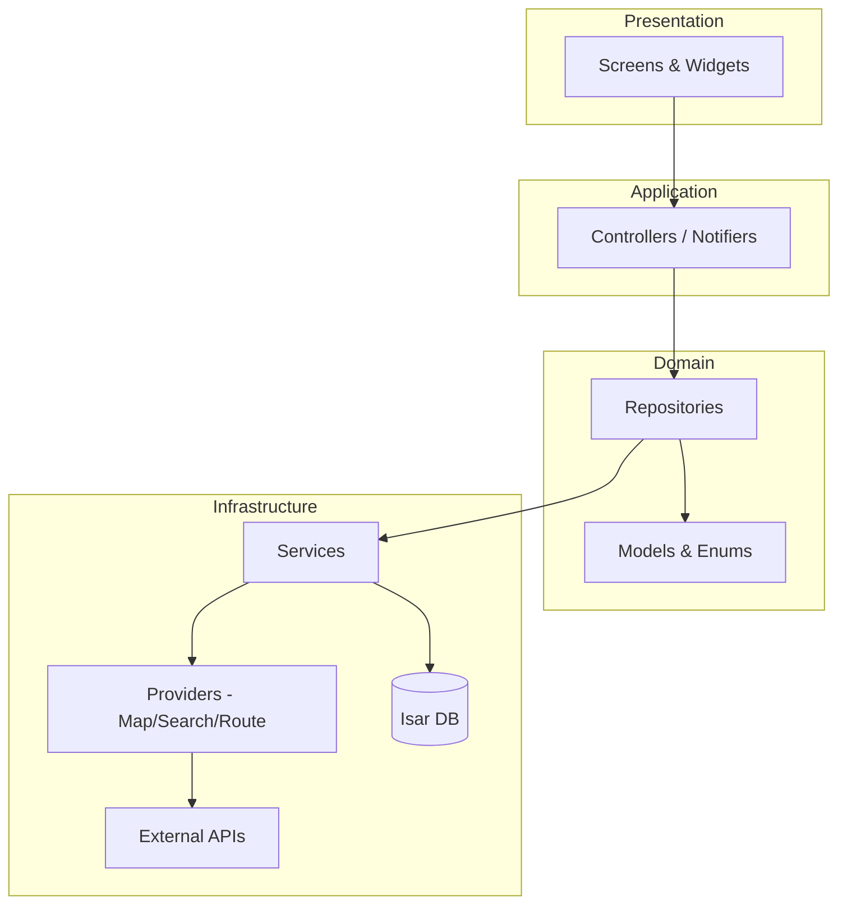

---

## 2. Alarm Trigger Sequence

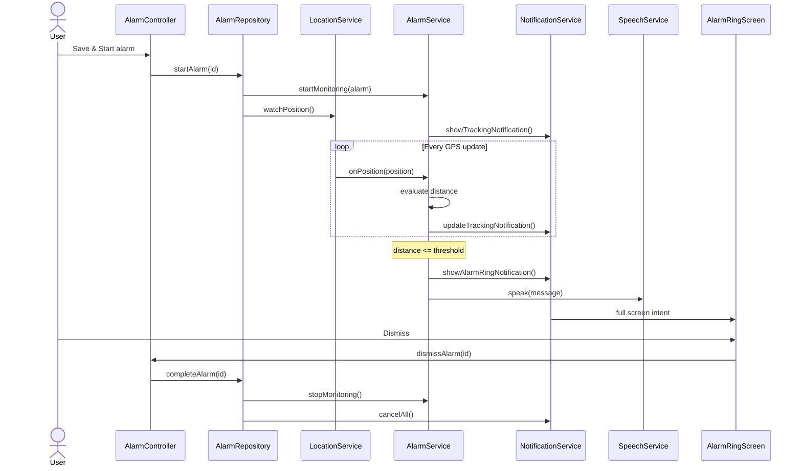

---

## 3. Search & Create Alarm Sequence

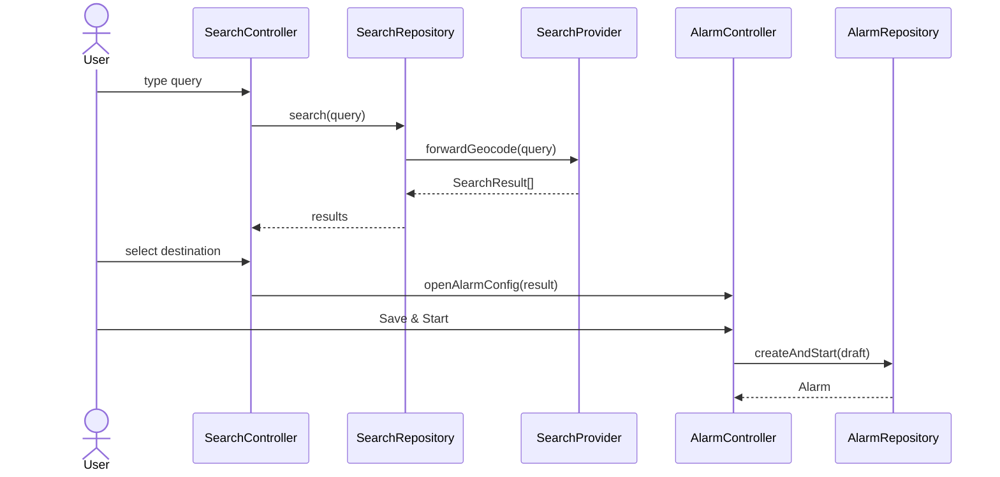

---

## 4. Alarm State Diagram

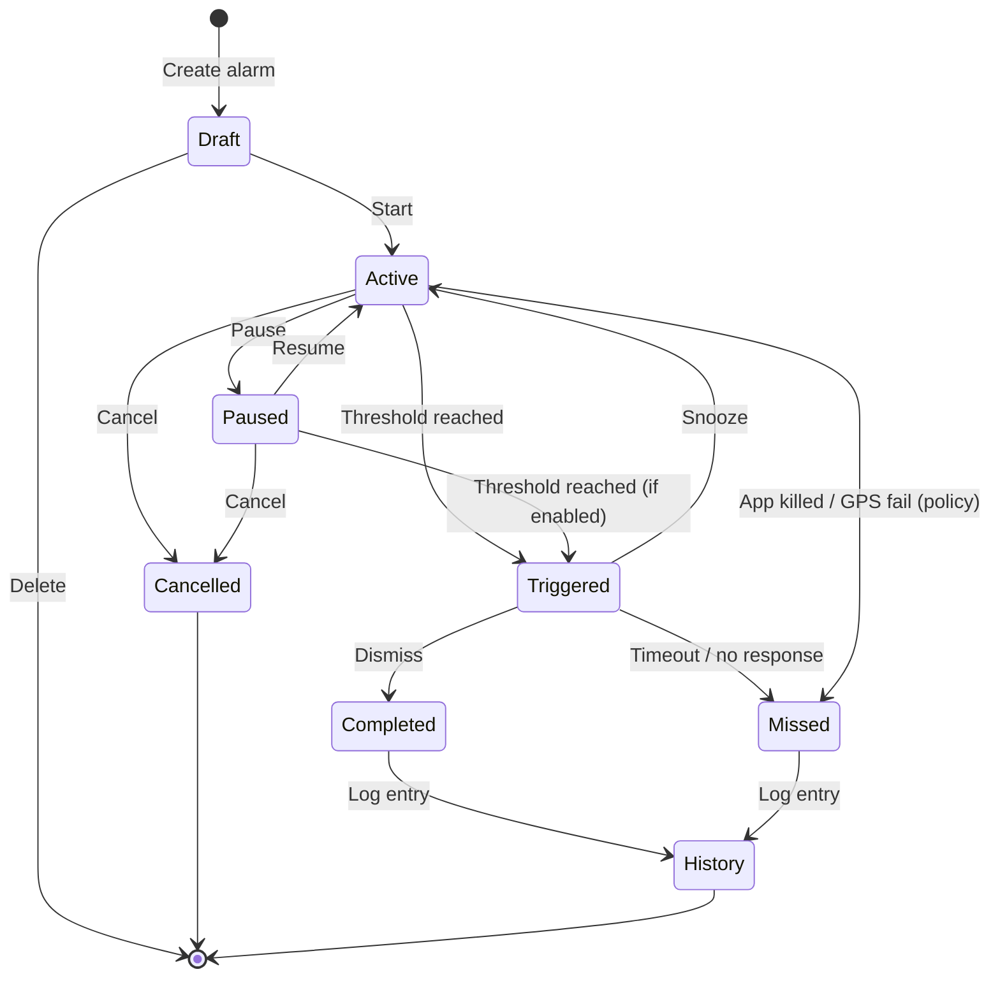

---

## 5. Trip Lifecycle State

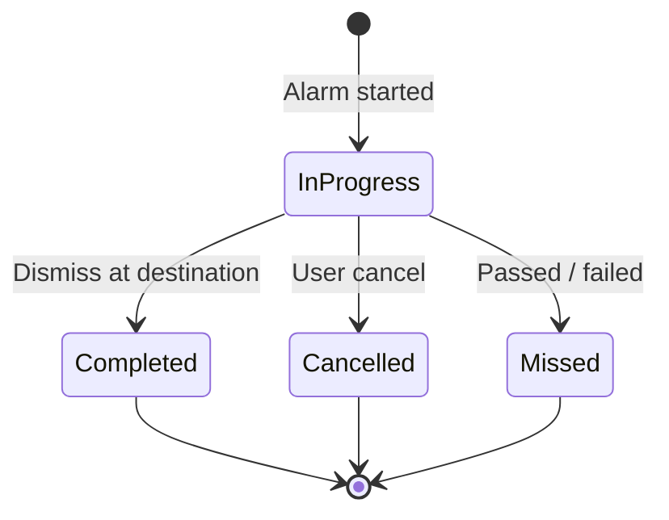

---

## 6. Database Entity Relationships

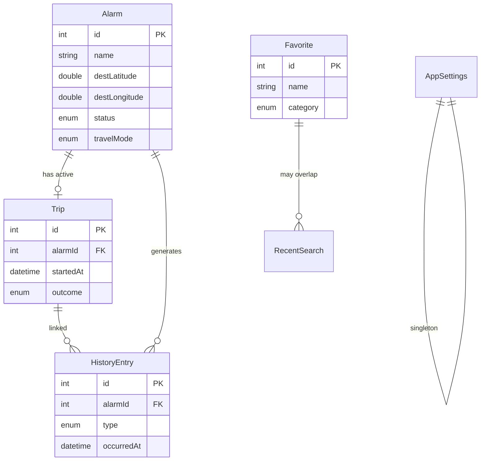

---

## 7. Folder Structure

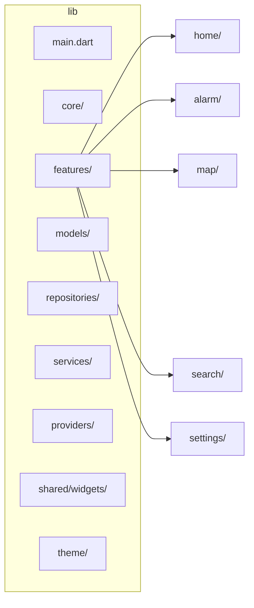

---

## 8. Riverpod Provider Tree (Simplified)

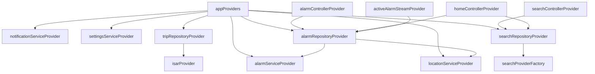

---

## 9. Service Layer Dependencies

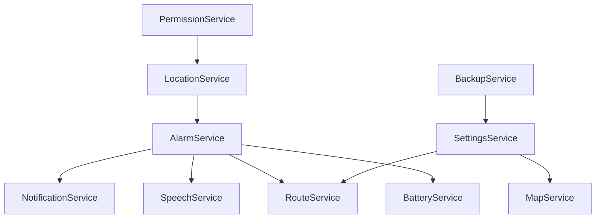

---

## 10. Permission Onboarding Flow

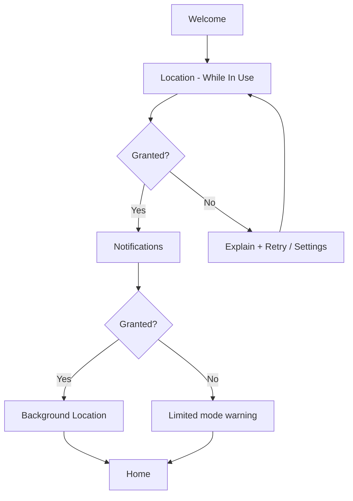

---

## 11. Offline Fallback Flow

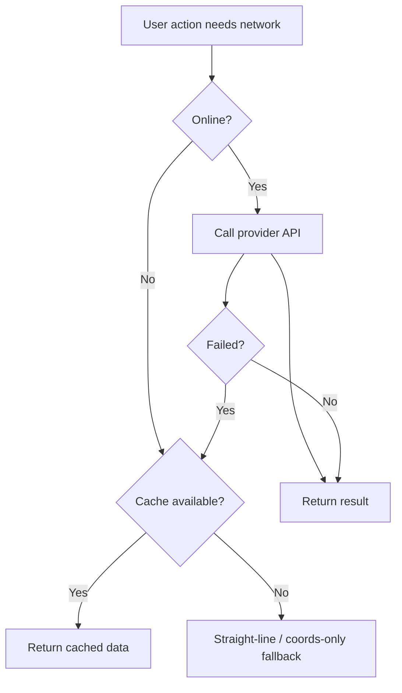

---

## Related Docs

* [Architecture](ARCHITECTURE.md)
* [User Flows](USER_FLOWS.md)
* [Database](DATABASE.md)
* [Services](SERVICES.md)
